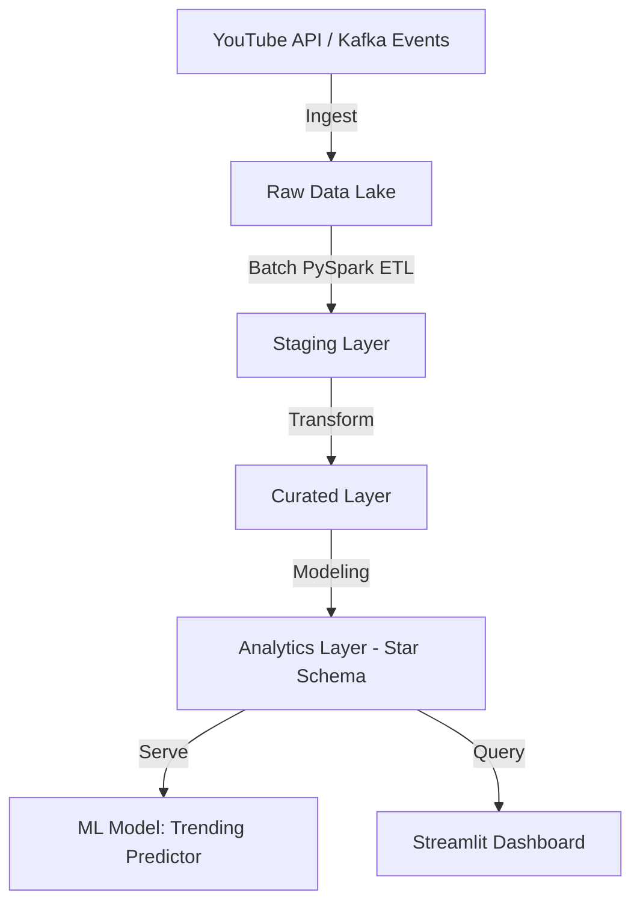

# YouTube Analytics Data Platform 🎬📊

An end-to-end **data engineering project** that simulates the scale of YouTube Analytics using **batch + streaming pipelines, data modeling, and ML**.

---

## 🚀 Architecture

